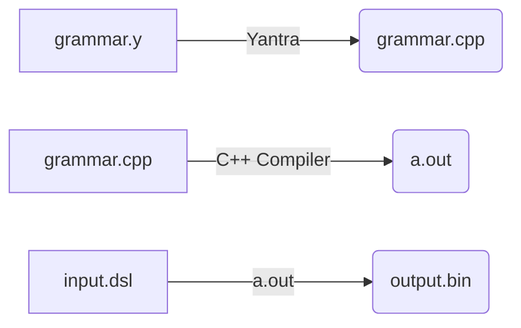
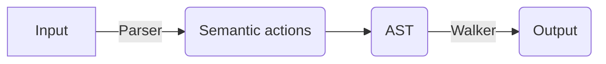
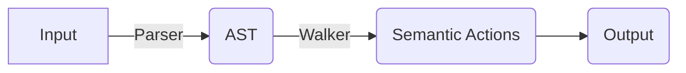
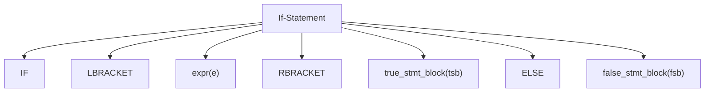

# Overview
Yantra is a standalone executable (`ycc.exe` on Windows, `ycc` on mac and linux) that reads a context-free grammar and generates a parser capable of parsing that grammar.

It takes a .y file as input and generates a .cpp file. Consider this commad line:
```
ycc -f mygrammar.y
```
This will generate a mygrammar.cpp and mygrammar.hpp file.

Amalgamated mode:
Yantra can generate a fully self-contained parser executable, including an auto-generated main() function.
This main() function handles most common use-cases, such as:
- opening and reading an input file,
- passing it to the parser,
- running a walker and generating an output file.

We can do this by specifying a `-a` option, like this:
```
ycc -f mygrammar.y -a
```

In addition, it also generates the following files:
- a .log file that contains a log of the processing operations, and
- a .md file, that contains the parsed grammar and state tables for debugging

## Approach
Yantra redefines how we see parser generators.

Traditional LALR parser generators work as follows:
- you define a set of rules, and functions (aka semantic actions) that execute when a rule is reduced.
- when an input file is parsed, it generates an output file directly, or
- it creates an AST (Abstract Syntax Tree) from which the output file is generated.

Yantra on the other hand, uses a two-step process, as follows:
- In the first pass, Yantra parses the input and builds an AST.
- In the next pass, it traverses the AST and calls the functions associated with each recognised rule.

This is explained in more detail further below.

# Grammar
*I consider sqlite3 a hallmark of well-written software, and try to internalise the style of the author (D.R. Hipps) as far as possible.
The syntax for the grammar in Yantra is heavily inspired by the lemon parser generator found in the sqlite3 source code.*

Yantra uses standard BNF to specify the grammar.

It uses named symbols in the rules, unlike the numbered symbols in YACC, etc.
Terminals are all uppercase, while non-terminals must have a lowercase first letter.

```
stmt := IF LBRACKET expr(e) RBRACKET true_stmt_block(tsb) ELSE false_stmt_block(fsb);
```

# Basic flow
The basic use case for Yantra is identical to that of any existing parser generators such as YACC, BISON, LEMON, etc.


Yantra reads the grammar file and generates the parser(a.out).

The parser reads the input and produces the output.

# The two-step process
This is the most significant feature of Yantra, which sets it apart from all other parser generators.

The generated parser (a.out) uses this process to parse input files and execute the semantic actions.

In existing parser generators, the parser reads the input and invokes the semantic actions associated with each rule as and when the rule is reduced.

The semantic actions will typically be used to generate an AST. Then the AST is taversed and the required output is generated. The developer has to write, by hand, the code to define the AST data structures and thhe code to walk the AST.

In Yantra, the AST is auto-generated. Each rule has one or more code blocks defined as functions (in the functional programming sense), that can be called from the parent nodes. The functions are embedded into AST walkers, which are also auto-generated.

#### Parser generated by traditional parser generators


#### Parser generated by Yantra


In the two diagrams above, the boxes labelled `Semantic Actions`, and everything to its right, have to be hand-written by the developer.

**As can be seen, a large part of the boilerplate code that the developer would have had to write (the AST nodes and the walkers), is now auto-generated by Yantra.**

# Defining Semantic Actions
Consider the following grammar rule.
```
stmt := IF LBRACKET expr(e) RBRACKET true_stmt_block(tsb) ELSE false_stmt_block(fsb);
%{
    //...
%}
```
***Terminology:** The first line `(stmt :=...)` is known as a production, and the next few lines within the `%{...%}` is known as the semantic action (or code block). The production and action together is known as a rule.*

The parser reads the input and creates the corresponding AST, which  would look like this:


In any existing LALR parser, the action would be executed during the parsing phase, as soon as the production is reduced.

In Yantra, the entire AST is first created during the parsing phase.
After the entire AST hs been fully constructed, it is traversed top-down, and the actions are executed during the traversal.

In effect, the parsing is bottom-up (being LALR), while the traversal is top-down, just like in recursive descent parsers.

This is a significant improvement over traditional LALR parsers, where the programmer is forced to implement all semantic actions based on them being executed in a bottom-up sequence.

This allows us to implement REPL-like semantic actions, as below:
```
stmt := IF LBRACKET expr(e) RBRACKET true_stmt_block(tsb) ELSE false_stmt_block(fsb);
%{
    if(eval(e) == true) {
        go(tsb);
    }else{
        go(fsb);
    }
%}
```

We now have the ability to evaluate the conditional expression and decide which child(s) of a particular node to traverse, from within the semantic action.

# Full Example
Consider the following grammar for a language that can be translated to C++ or Java:
```
start := stmts;

stmts := stmts stmt;
stmts := stmt;

stmt := ID EQUAL qualifiedID SEMI;

qualifiedID := qualifiedID DBLCOLON ID;
qualifiedID := ID;

ID := "[\l][\l\d_]*";
DBLCOLON := "::";
EQUAL := "=";
SEMI := ";";
```

This grammar recognizes inputs such as
```
var1 = var2;
var1 = ns1::var2;
var1 = ns1::ns2::var2;
```
Where `var1` and `var2` are variables, and `ns1` and `ns2` are namespaces.

If we were to generate C++ code from this input, it would look the same, as below:
```
var1 = var2;
var1 = ns1::var2;
var1 = ns1::ns2::var2;
```

Whereas Java uses a period instead of double-colon for qualified variables,
so if the above input was converted to Java, the generated code would look like this:
```
var1 = var2;
var1 = ns1.var2;
var1 = ns1.ns2.var2;
```

Typically, we would specify code blocks associated with each rule, that will:
- build a handcrafted AST, and later separate code generators will walk down the AST and generate C++ code or Java code
- or the codeblock will directly generate the C++ or Java output, using a flag and if-statement to determine which language to generate.

In Yantra, all of the above would be implemented as follows:
<pre><code>
<i>
// define two AST walkers, one for generating C++ code and the other for Java
</i>
%walkers CppWalker JavaWalker;

<i>
// this is the start rule. It recognizes a list of statements
</i>
start := stmts;

<i>
// this pair of rules recognizes a list of statements
</i>
stmts := stmts stmt;
stmts := stmt;

<i>
// this rule recognizes a simple assignment statement.
// it has code blocks for each of the two defined walkers.
</i>
stmt := ID(I) EQUAL qualifiedID(qid) SEMI
@CppWalker
%{
    <i>// this calls the str() function defined for CppWalker below</i>
    std::cout << I.text << " = " << str(qid) << std::endl;
%}
@JavaWalker
%{
    <i>// this calls the str() function defined for JavaWalker below</i>
    std::cout << I.text << " = " << str(qid) << std::endl;
%}

<i>
// This pair of rules recognises a qualifiedID,
// which is one or more ID's, separated by double-colons
// Each rule defines a str() function
</i>
%function qualifiedID CppWalker::str() -> std::string;
%function qualifiedID JavaWalker::str() -> std::string;
qualifiedID := qualifiedID(qid) DBLCOLON ID(I)
@CppWalker::str
%{
    return str(qid) + "::" + I.text;
%}
@JavaWalker::str
%{
    return str(qid) + "." + I.text;
%}

qualifiedID := ID(I)
@CppWalker::str
%{
    return I.text;
%}
@JavaWalker::str
%{
    return I.text;
%}

<i>
//This defines all the lexer tokens
</i>
ID := "[\l][\l\d_]*";
DBLCOLON := "::";
EQUAL := "=";
SEMI := ";";
WS := "\s"!;
</pre></code>

As seen above, we can attach multiple walkers to a single grammar, and define functions within each walker.
