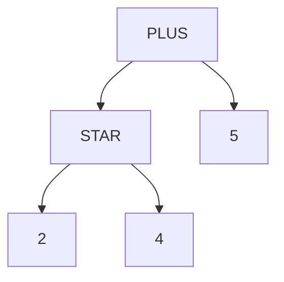
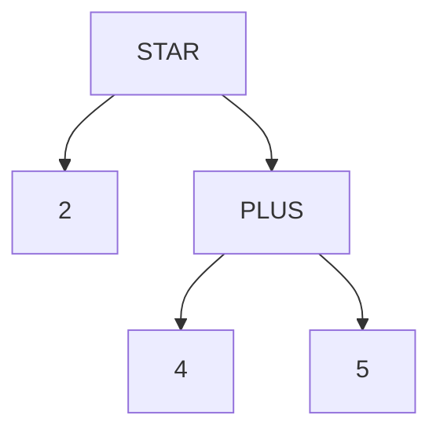

# Lexer calls Parser
In parser generators such as YACC and BISON, the parser calls the lexer to get the next available token.

Yantra follows the LEMON approach, where the lexer calls the parser when it recognises a token.

# Walkers
Parser generators such as YACC, BISON and LEMON allow us to attach a semantic action (typically a C or C++ code block) with a production, and this action is invoked as soon as the production is reduced.

On the other hand, Yantra automatically creates an AST, and the semantic actions are invoked while walking the AST in top-down order.

This approach now allows us to define one (or more) Walkers to walk the generated AST.

# Functions
In Yantra, semantic actions are referred to as functions, in the functional programming sense.
Every walker can have multiple functions for a rule.
The user can define any number of user-defined functions per rule, per walker.

# Walker Traversal
In addition, each walker has a default built-in function called `go` that is automatically traversed when the walker is invoked.

This behaviour can be turned off using the `%walker_traversal` pragma

# Walker Output
A typical use for a walker is to:
- either generate output files. (compile)
- or evaluate and print output (REPL)

Use the `%walker_output` pragma to specify that a walker will generate a file, and it will create a std::ofstream object ready for writing.

# Walker hierarchy
Walkers are common C++ classes, and can derive from each other.

e.g: Consider a case where you want to implement a gRPC-like language, and want to generate server-side and client-side code.
```
%walkers CppWalker CppServer(CppWalker) CppClient(CpWalker)
```
Here, CppServer and CppClient derives from CppWalker.

The separation of functionality would be as follows:
- CppServer generates the server-side code
- CppClient generates the client-side code.
- Base class CppWalker handles functionality that is common to both, such as translating `string` to `std::string`

# Lexer Modes
Yantra supports multiple lexer modes, where the same regex can result in a different token, depending on the current lexer mode.

# Precedence
Operator precedence dictates the structure of the syntax tree created from an expresson.

e.g: consider the following expression:
```
2 * 4 + 5
```

It can resolve to either this tree:


or this tree:


The first tree is the correct one, since the STAR operator has a higher precedence over PLUS.

In Yantra, the precedence is defined by the order in which the tokens are defined in the lexer.
```
PLUS := "\+";
STAR := "\*";
```
Here, STAR has a higher precedence than PLUS.

Sometimes, operators should have the same precedence, e.g: PLUS and MINUS have the same precedence.

This is expressed as follows:
```
PLUS := "\+";
MINUS := "-" [PLUS];
```
This line indicates that the MINUS token has the same precedence as the PLUS token.

## Rule precedence
By default, rules take on the precedence of the first token in the production.

```
expr := expr PLUS expr;
```
Here, precedence  of `expr` will be the same as that of PLUS.

# Association
In some cases the lexer sees two tokens with the same precedence. e.g:
```
2 + 4 + 5
```
In this case, the lexer needs to resolve whether to reduce `2 + 4`, or shift `+ 5`
We can disambiguate this using `%left` prgama.
```
%left PLUS;
```
With this line, we tell the lexer to reduce the '2 + 4` first and then shift the second `+`
