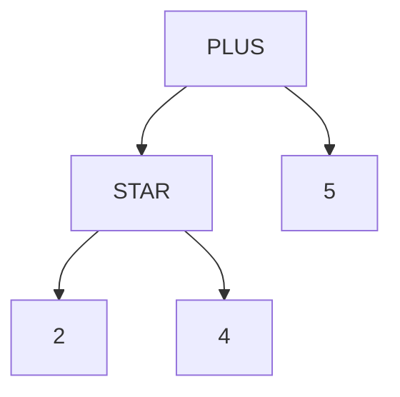
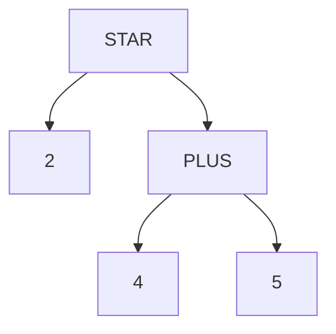

# Lexer calls Parser
In parser generators such as YACC and BISON, the parser calls the lexer to get the next available token.

Yantra follows the LEMON approach, where the lexer calls the parser when it recognises a token.

# Walkers
Parser generators such as YACC, BISON and LEMON allow us to attach a semantic action (typically a C or C++ code block) with a production, and this action is invoked as soon as the production is reduced.

On the other hand, Yantra automatically creates an AST, and the semantic actions are invoked while walking the AST in top-down order.

This approach now allows us to define one (or more) Walkers to walk the generated AST.

# Functions
In Yantra, semantic actions are referred to as functions, in the functional programming sense.
Every walker can have multiple functions for a rule.
The user can define any number of user-defined functions per rule, per walker.

# Walker Traversal
In addition, each walker has a default built-in function called `go` that is automatically traversed when the walker is invoked.

This behaviour can be turned off using the `%walker_traversal` pragma

# Walker Output
A typical use for a walker is to:
- either generate output files. (compile)
- or evaluate and print output (REPL)

Use the `%walker_output` pragma to specify that a walker will generate a file, and it will create a std::ofstream object ready for writing.

# Walker hierarchy
Walkers are common C++ classes, and can derive from each other.

e.g: Consider a case where you want to implement a gRPC-like language, and want to generate server-side and client-side code.
```
%walkers CppWalker CppServer(CppWalker) CppClient(CppWalker);
```
Here, CppServer and CppClient derives from CppWalker.

The separation of functionality would be as follows:
- CppServer generates the server-side code
- CppClient generates the client-side code.
- Base class CppWalker handles functionality that is common to both, such as translating `string` to `std::string`

# Lexer Modes
Yantra supports multiple lexer modes, where the same regex can result in a different token, depending on the current lexer mode.

# Precedence
Operator precedence dictates the structure of the syntax tree created from an expresson.

e.g: consider the following expression:
```
2 * 4 + 5
```

It can resolve to either this tree:

```mermaid
flowchart TD
    A[PLUS] --> C[STAR]
    A --> D[5]
    C --> E[2]
    C --> F[4]
```

or this tree:

```mermaid
flowchart TD
    A[STAR] --> D[2]
    A --> C[PLUS]
    C --> E[4]
    C --> F[5]
```

The first tree is the correct one, since the STAR operator has a higher precedence over PLUS.

Consider a grammar shaped like this: an ambiguous rule for each operator that recurses directly back into itself, e.g. `expr := expr PLUS expr;` and `expr := expr STAR expr;`. A shift/reduce conflict decides this tree. It's resolved by comparing the precedence of the rule that would **reduce** (here, the PLUS rule, since `2 + 4` is what's sitting on the stack) against the precedence of the lookahead token that could instead be **shift**ed (here, STAR). Declare the operators with `%left`/`%right`, in ascending order of precedence:
```
%left PLUS;
%left STAR;
PLUS := "\+";
STAR := "\*";
```
Each pragma line gets a higher precedence value than the last, so STAR (declared second) outranks PLUS here. On lookahead STAR, the PLUS-reduce's precedence (lower) loses to STAR's (higher), so the parser shifts and builds `2 * 4` before reducing the `+`. This gives the correct, first tree above.

With no pragma at all, a rule has no declared precedence, and the conflict defaults to shift, same as yacc/bison's default shift/reduce resolution. For this grammar, that also produces the correct tree, but only because a shift happens to be the right call here. Don't rely on that as a substitute for declaring precedence when it matters.

An alternative to this pragma-based style is to use a separate rule (a "subrule") per precedence level, and have the lower-precedence rule use the higher one as its operand, instead of every operator sharing one ambiguous rule. This avoids reasoning about numeric precedence values entirely, and is the better choice once you have more than a couple of levels. See the [Tutorial](../tutorial/)'s "Stage 3: Operator Precedence" for a complete, working example.

Sometimes, operators at the *same* precedence level should associate the same way, e.g: PLUS and MINUS.

This is expressed by listing them on the same `%left`/`%right` line:
```
%left PLUS MINUS;
PLUS := "\+";
MINUS := "-";
```
This line makes MINUS associate the same way as PLUS.

## Rule precedence
By default, a rule takes on the precedence of the first real *terminal* (token) in its own production. Nonterminal (rule) references are skipped when looking for it.

```
expr := expr PLUS expr;
```
Here, precedence of this rule will be the same as that of PLUS.

If a rule's production has no terminal at all, whether because every node is a nonterminal reference or because the production is empty (`expr := ;`), the rule has **no** precedence. It never borrows one from whatever nonterminal it references. A conflict involving such a rule simply defaults to shift, same as the no-pragma-declared case above.

# Association
In some cases the lexer sees two tokens with the same precedence. e.g:
```
2 + 4 + 5
```
In this case, the lexer needs to resolve whether to reduce `2 + 4`, or shift `+ 5`
We can disambiguate this using `%left` pragma.
```
%left PLUS;
```
With this line, we tell the lexer to reduce the '2 + 4` first and then shift the second `+`
