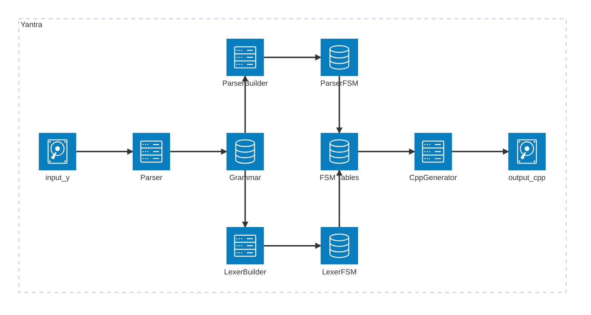

This diagram describes the end-to-end process by which all above classes interact to convert the `input.y` file to `output.cpp`



## Parser
The Parser class reads the input.y file and creates the Grammar object.

_(A Lexer class in the Parser reads the .y file and splits it into a stream of tokens first)_

## Grammar
The Grammar class holds the input grammar, which is read and parsed from the input.y file.
It also holds the State Machine tables which are built.

## LexerBuilder
The LexerBuilder class creates the Lexer State machine, for the generated parser, from the Grammar.

## ParserBuilder
The ParserBuilder class creates the LALR State machine, for the generated parser, from the Grammar.

## CppGenerator
The CppGenerator takes the lexer and parser State Machines and generates the output.cpp code that implements the Parser defined in the input grammar.

# Building the project
Yantra is a pure standalone app with no dependencies except the C++ standard libraries.

Hence building it is a very straightforward process.
1. Clone the repository
```
git clone git@github.com:TantrixAuto/yantra.git
git checkout <branch>
```

2. Generate the cmake build directory at any location
```
mkdir build
cd build
cmake ..
```

3. build the project
```
cmake --build .
```

4. use executable `ycc` (or `ycc.exe`) from the bin directory
```
bin/ycc --help
```

5. generate a sample parser
```
bin/ycc -f ../samples/basic.y -a
```

6. observe that two files were generated:
```
basic.cpp
basic.log
```

7. build the generated parser
```
clang++ --std=c++20 basic.cpp
```

8. run the parser
```
./a.out --help
./a.out -w CppWalker -s "x = a::b;"
```
